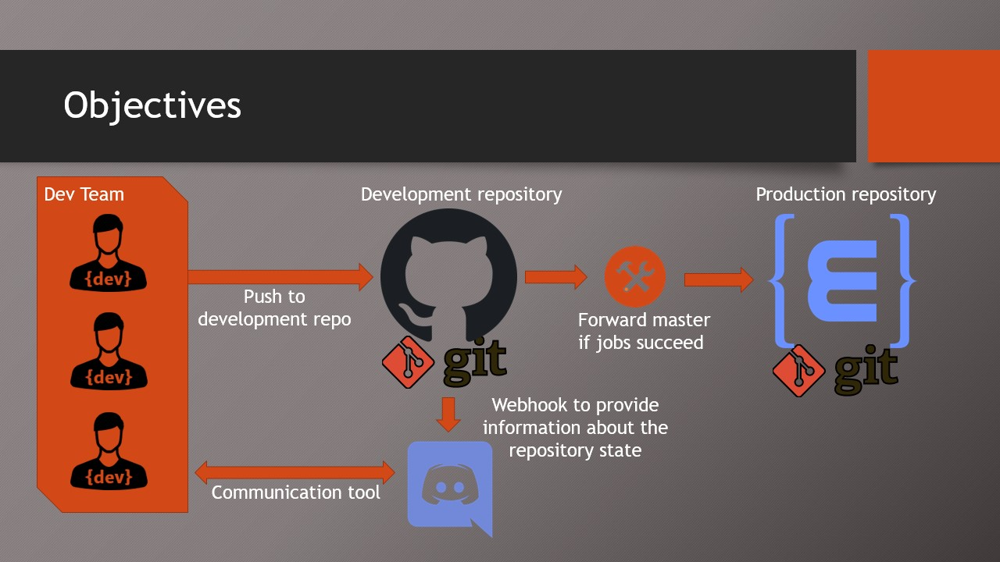
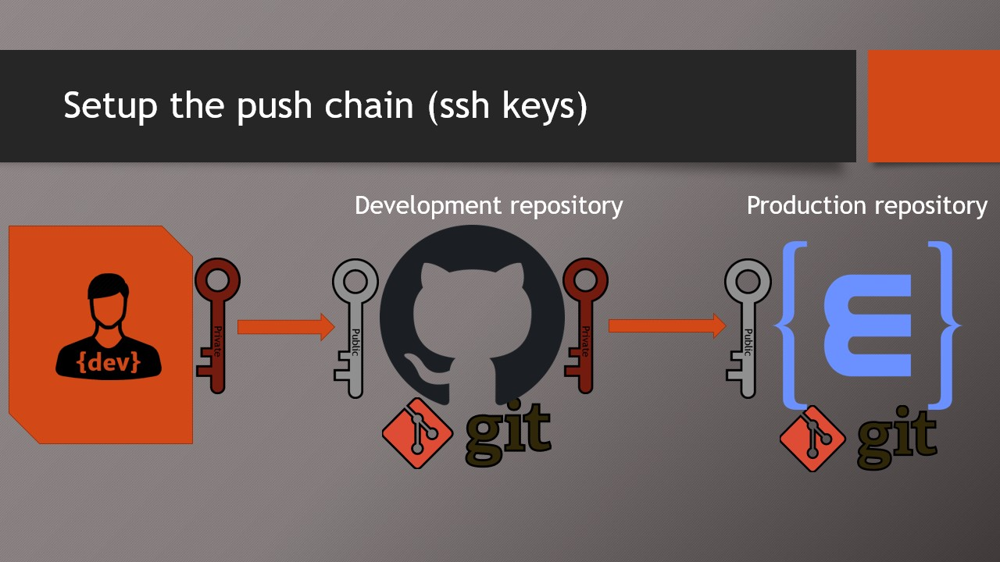
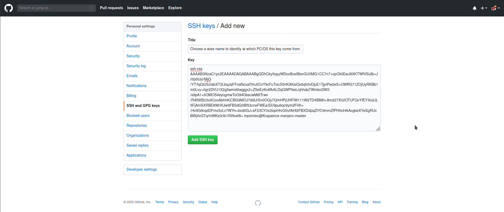
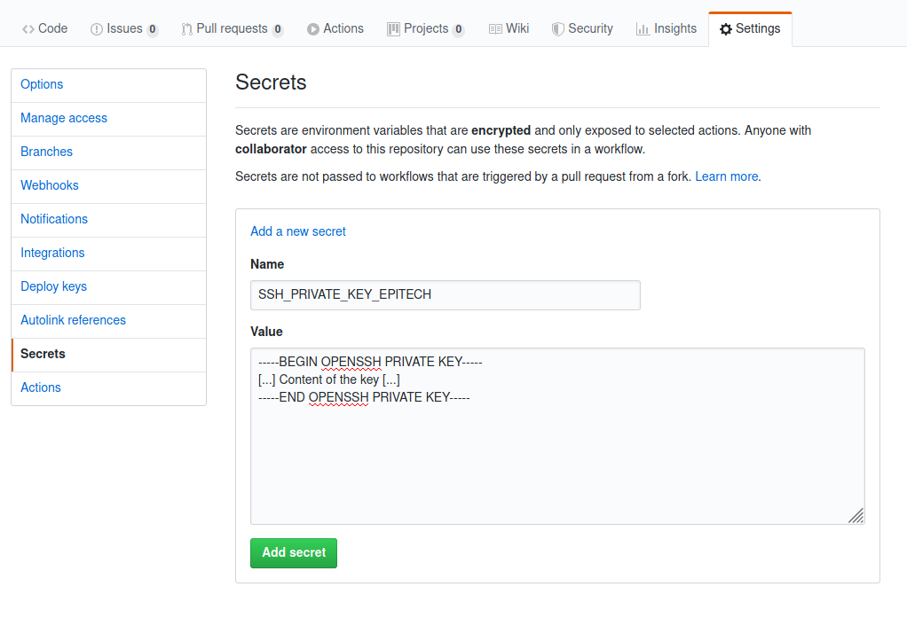
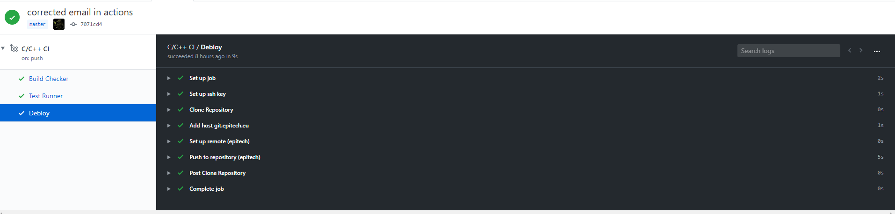
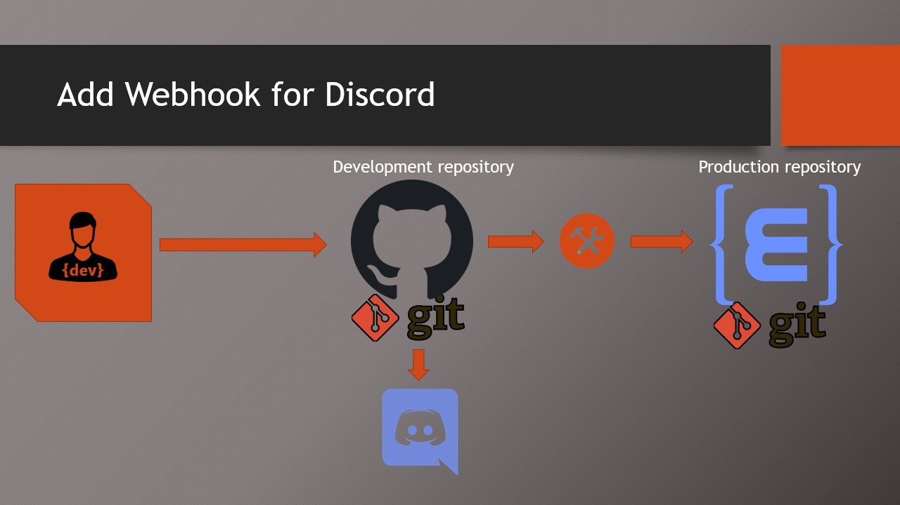

# Workshop - Organize your workflow with Github and Discord

This file is a step by step guide to setup a project like in the following image:


To follow this tutorial you need epitech's blih script. It can be found [here](https://gitlab.com/EpitechContent/dump/-/tree/master)

You migth create a test repository on github and on epitech to test that everything is working as expected. In this tutorial we will call our github test repository `git_repo` and our epitech one `epi_repo`.

## Setup the push chain


### Step 1: Setup ssh keys between you and Github

In order to push on Github, you need to setup an sshkey. As you generate one during your CPool, you must generate a key for `github.com`

- Generate a new key
```bash
cd ~/.ssh # Go to the folder in which you store your ssh keys
ssh-keygen -f id_rsa_github -C "your_email@example.com"
```

A pair of keys is generated by this command. The public key `id_rsa_github.pub` and the private key `id_rsa_github`.

After generating your key, you must add the public part of the key to your github account.

`Note`: if github tells you that the key is incorrect, generate the key with this command
```bash
ssh-keygen -f id_rsa_github -C "your_email@example.com" -t rsa -b 4096
```

`Note`: You can use the same key as you already use for epitech, but , you should generate a new one to be safe.

- Upload your key on github

Go to the website github.com and log in with your github account.
Once connected, your can go to your account's settings (https://github.com/settings/profile).

Go to the section `SSH and GPG keys` and add a `New SSH key`.
Give the key a good name so that you can remember from where your key comes from. Then paste the content of the public key in the key input (`~/.ssh/id_rsa_github.pub`).


- Create ssh config

Once your ssh key is uploaded on github, you should theoretically be able to clone your github repository. But if you think by yourself, there is now two pairs of ssh keys in `~/.ssh` so, which one should ssh choose ?

Awnser: if there isn't a config file it chooses the first key that it finds.

To solve this problem you must create a configuration file in your `~/.ssh` folder like so:
```bash
cd ~/.ssh
touch config
```
Add this to the `config` file:
```
Host git.epitech.eu
	HostName git.epitech.eu
	User git
	IdentityFile ~/.ssh/id_rsa_epitech

Host github.com
	HostName github.com
	User git
	IdentityFile ~/.ssh/id_rsa_github
```
Your ssh configuration now specifies which key should be used for each host.

`Note`: __Pay attention to the path after `IdentifyFile`, it must match your key filename__.

SSH identification process needs a particular file mode on `~/.ssh/config` to use it. The file must be `read-only`. Here is the command to apply this mode
```bash
chmod 400 ~/.ssh/config
```

#### Checkpoint Setup Github ssh keys
You are now able to work with `github.com` and `git.epitech.eu`.
Try to `clone` / `push` on the two hosts to be sure that your ssh configuration is working as expected.

### Step 2: Setup Github ssh keys between Github and Epitech (deploy key)

Now that you can push on your github repository, we need to give github repositories an access to our epitech ones.

- Generate the `deploy_key`:


We will need another SSH key to perform this operation. This key will only be used for automatic operation so you can put it in a subfolder of `~/.ssh`:
```bash
cd ~/.ssh
mkdir deploy_key
cd deploy_key
ssh-keygen -f id_rsa_github_to_epitech -C "deploy_key_github_to_epitech"
```
`Note`: Naming those keys is not important for now. But when you will come back in a month you may not remember which one is used for what. So put those names on your key files!

- Setup the public deploy key (Epitech):

Now that you have generated your deploy key, upload the public part on epitech with `blih`
```bash
blih -u firstname.lastname@epitech.eu sshkey upload ~/.ssh/deploy_key/id_rsa_github_to_epitech.pub
```

- Setup the private deploy key (Github):

The private part will be put in the secret part of our repository. Go to your repository page then click on the settings tab. Then go to the secrets section.

In this private section click on `Add secret`. Name your secret with a good name that will be used later to access at our private key (`SSH_PRIVATE_KEY_EPITECH`).

Paste the content of your private key in the value field.
```bash
cat ~/.ssh/deploy_key/id_rsa_github_to_epitech
```

`Note`: If you want to use another name, it must be in UPPER_CAMEL_CASE.


- Setup the `workflow`

We now need to setup a workflow. But first what is a workflow ?

A `workflow` is a set of `jobs`. A `job` is composed of a set of `steps`. A `step` is a simple command (e.g: `make tests_run`).

When a `workflow` will be launched it will run every `jobs` at the same time. The `steps` composing a job will then be run one by one.

Now that you know a bit more about the `workflow` of github, let's set it up.

To run a workflow you first need to create one. Copy the `workflow.yml` at the root of this repository and put it in your `git_repo` like so:
```bash
./git_repo/
└── .github/
    └── workflows/
        └── workflow.yml
```

Now that you put this file in your repository, let's see how it works. We also need to configure some ligns inside.

We will start with what triggers the workflow.

```yml
# at each push or pull_request on the branch master run the jobs
on:
  push:
    branches: [ master ]
  pull_request:
    branches: [ master ]

# [...]
```
Now let's see how to setup the `jobs`
```yml
# [...]

jobs: # Start the jobs section
  build: # Declare a new job with as id 'build'
    name: Build Checker # Give a name to the job
    runs-on: ubuntu-latest # Define what the job should run, you can find more information here:
                           # https://help.github.com/en/actions/reference/workflow-syntax-for-github-actions#jobsjob_idruns-on
    steps: # Start the step section
      # A Step starts with '-'. All the following pairs of 'key: value' will be part of the step until the next '-'
      # Futher informations about the yml can be found here: https://help.github.com/en/actions/reference/workflow-syntax-for-github-actions#about-yaml-syntax-for-workflows

      - uses: actions/checkout@v2 # 'uses' specify the usage of an action (individual tasks)
                                  # Futher informations about action: https://help.github.com/en/actions
        # 'checkout' action will clone the repository with only the last commit on master

      - name: Build Standard # Define a step name 'Build Standard' which will run the command 'make' in a shell of type `bash`
        shell: bash
        run: make

  tests: # Another job ...
    name: Test Runner
    runs-on: ubuntu-latest
    steps:
      - uses: actions/checkout@v2

      - name: BuildTest
        shell: bash
        run: make tests_run

# [...]
```

Now that we have jobs to run our unit tests and to build our project, let's see how to push to our `epi_repo` in case of success

```yml
# [...]

jobs:

# [...]

  deploy: # Just another job name 'deploy', otherwise nothing to read here
    name: Deploy
    needs: [build, tests] # 'needs' allow us to make the job wait for other jobs to finish. Here we wait for the jobs 'build' and 'tests'.
                          #  If one of the build fails in the set of 'needs', this task won't be executed.
    runs-on: [ubuntu-latest]
    steps:
      - name: Set up ssh key # To push on our epitech repository, we will need a private key. This private key is the deploy key that we have put in the secret section of our github repository.
        uses: webfactory/ssh-agent@v0.2.0 # 'ssh-agent' will get the key from the repository's secret and set it up.
        with: # If you have named your deploy key with a different name, you need to change 'SSH_PRIVATE_KEY_EPITECH' with your secret's name.
          ssh-private-key: |
            ${{ secrets.SSH_PRIVATE_KEY_EPITECH }}

      - name: Clone Repository # We use the same action as we used in our 'build' and 'tests' jobs to clone our repository. But we use it with some arguments to clone the entire history of the master branch.
        uses: actions/checkout@v2
        with:
          ref: 'master'
          fetch-depth: '0' # get all history of master

      # Push on an epitech repository
      - name: Add host git.epitech.eu # By default,  if you use a new host, ssh will ask you if it is a trusted one. Here we add it before any operation with ssh so that it won't ask us a confirmation.
        shell: bash
        run: ssh-keyscan git.epitech.eu >> ~/.ssh/known_hosts

      - name: Set up remote (epitech) # To push our repository to another remote we need to setup a new one.
        shell: bash # Of course you need to edit the remote url to match it with your epitech repository
        run: |
          git remote add epitech git@git.epitech.eu:firstname.lastname@epitech.eu/epi_repo


      - name : Push to repository (epitech)
        shell: bash # Finally we push our master branch to the `epi_repo` by specifying our epitech remote.
        run: |
          git push epitech master
```

Now that you know everything about this workflow, you can push it on your `git_repo`.

#### Checkpoint Worflow github
Now that your two repositories are set up, you should test to push the content of the `project.zip` in your `git_repo`.
To check if everything is working as expected you should go in the action section of your `git_repo` on github.
Check that the last workflow run with the commit on the `project.zip` push has succedeed.


## Setup a webhook


If you want to have a message when someone pushes, create a `pull request`, etc.., you can setup a `webhook`.
It can easily be set up, take a look at this [tutorial](https://gist.github.com/eslachance/40ac1c8232a5a019b43ee3f588d637ad) or [this one](https://gist.github.com/jagrosh/5b1761213e33fc5b54ec7f6379034a22).

### Checkpoint Webhook

Test to trigger an event that you set up in your webhook. A message should pop in the discord channel.

## The end

Now that you have set up all your project you may add your teammates.

To work with them you may use `pull request`, `issue`, `project`, `wiki`. Those tools will allow you to track, report and follow the project better than with a separated tool like `trello`.

If you want more informations to use github:

- https://guides.github.com/features/issues/

- https://help.github.com/en/github/collaborating-with-issues-and-pull-requests/proposing-changes-to-your-work-with-pull-requests

- https://help.github.com/en/github/managing-your-work-on-github/managing-your-work-with-issues
